# JavaScript for Automation (JXA) ⚡️💻
## @joshparnham

---

^ I'm Josh, a developer working on iOS and JS stuff at Xero.

^ Talk was originally scheduled for May, but moved a month later. Since some of the example code and copyright information hasn't been touched since 2011 I was really worried that Apple would deprecate the scripting architecture at WWDC - thankfully the opposite happened!

# 😅

---

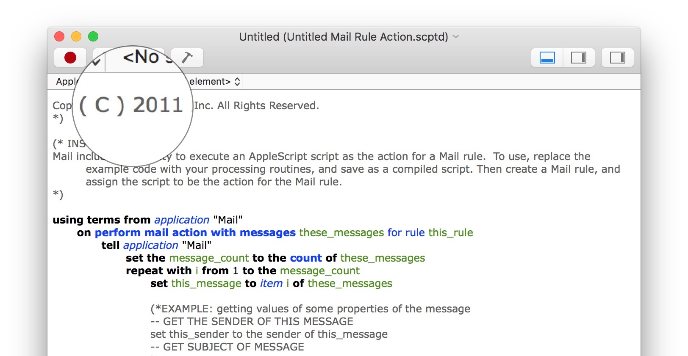

---

^ Aperture was discontinued in 2014/15
^ A `.scptd` file is a "Script Bundle"

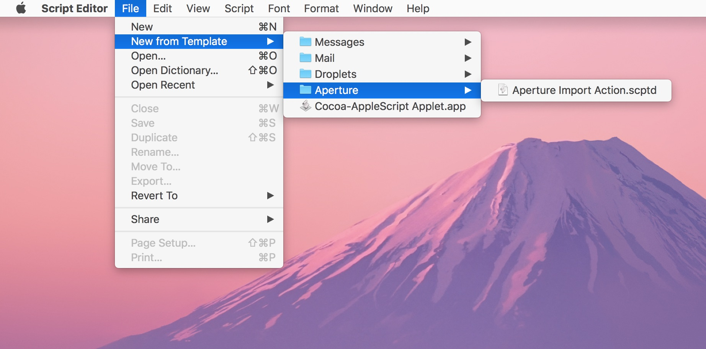

---

## Mac Automation ❓

^ macOS has set of rich built-in frameworks for automation.

- Automating tasks on macOS
    - Scripting supported Applications
    - UI element automation
    - System APIs

---

^ Traditionally macOS scripting has been accomplished with AppleScript, which is a language developed by Apple in 1993 - its goal was to create a programming language that featured an "English-like" syntax. As such, it can be very verbose and can feature a large learning curve for those who are more familiar with traditional languages.

# AppleScript

---

# AppleScript

> "If you're used to a programming language, AppleScript will drive you crazy"
-- Sal Soghoian

---

^ That is not ideal.


---

^ However thankfully, you can use JavaScript as an alternative to AppleScript, and since you're all sitting in this room with me tonight I'll assume that you also think this is absolutely awesome.

# JavaScript

---


---

## History 📚

^ This JavaScript scripting support was added in OS X Yosemite.

- OS X 10.10 Yosemite (2014)

^ The OSA makes use of Apple Events, which is an IPC mechanism that encapsulates commands and arbitrary data.

- Open Scripting Architecture
  - `osascript`/`osacompile` and friends

^ JavaScriptCore is a wrapper around WebKit's JavaScript engine

- JavaScript implementation based on `JavaScriptCore`

---

## Basics 👩‍🏫

```js
const Safari = Application('Safari')
const firstWindow = Safari.windows[0]
const tab = Safari.Tab({url: "https://joshparnham.com"})
firstWindow.tabs.push(tab)
firstWindow.currentTab = tab
```

---

# Script Editor.app 📜

^ The main IDE that you'll be using to write your automation scripts is Script Editor, just make sure you've selected JavaScript as the language.

---


---

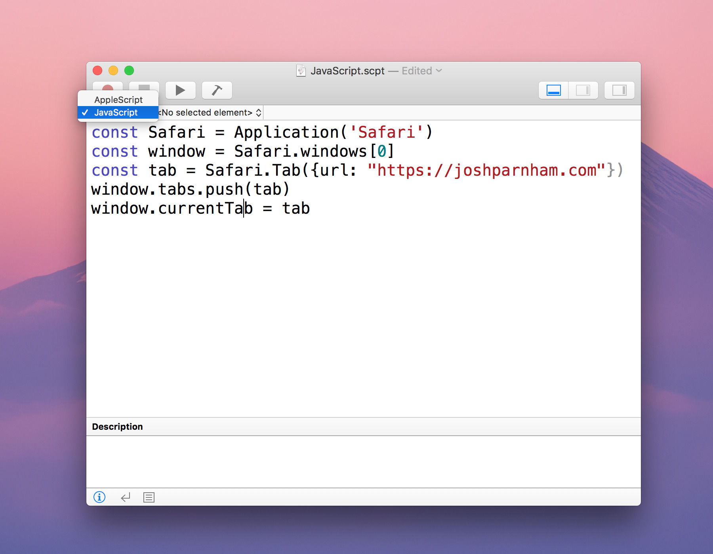

---

# Documentation 📕

^ The Script Editor is also where you can read documentation for both the scriptable apps and the system scripting features.

^ Can drag an application onto Script Editor, and if it has a `.sdef` file, those contents will be displayed. A `sdef` file is an XML-based file type which maps OSA commands to cocoa methods.

^ Viewing the Library (Window > Library) also lists documentation about various applications and system libraries.

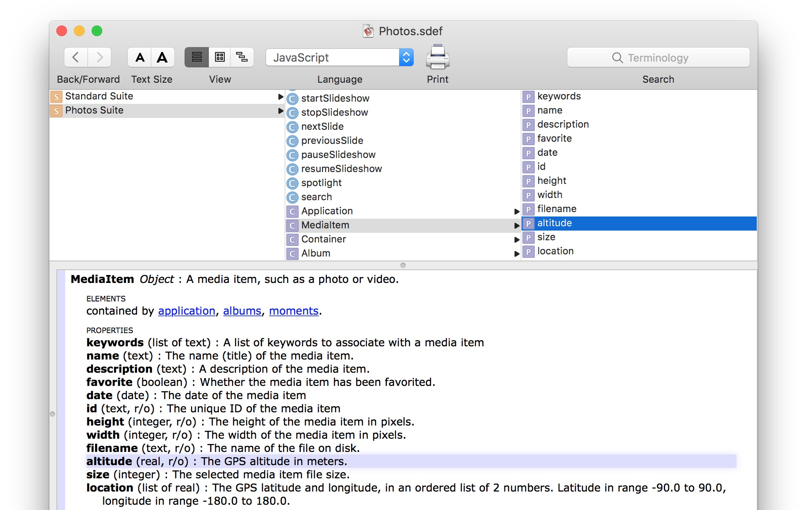

---

## Debugging 🐛

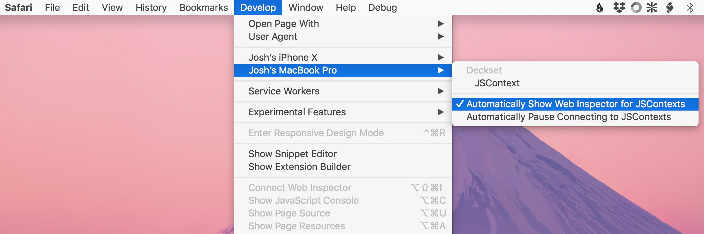

---

## Debugging 🐛

- `debugger;` statement in Script Editor

---

## Debugging 🐛

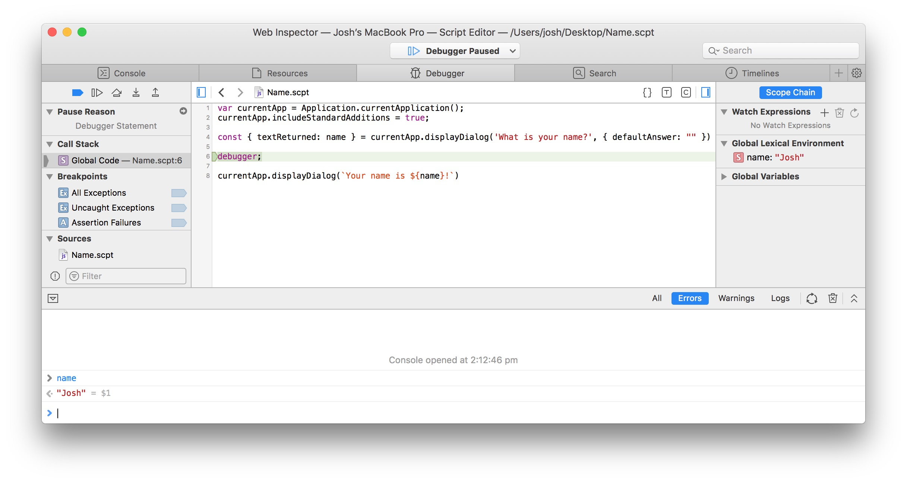

---

# Invocation ❇️

^ Can open a `.scpt` file from Finder, etc 
^ An scpt file is a binary representation of an AppleScript or JavaScript file
^ A plain-text AppleScript or JavaScript file can be converted into a compiled `.scpt` file from the Script Editor IDE or from the command line with `osacompile` (and visa-versa with `osadecompile`)

- `.scpt` file

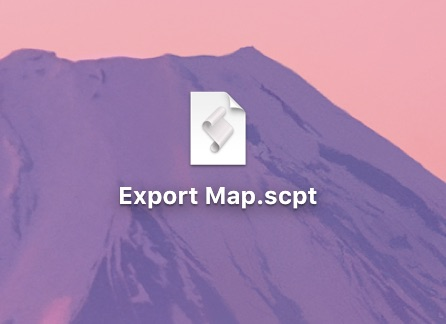

---

# Invocation ❇️

^ You can package your script as an applet which is treated like a regular application (eg. can drag items onto it when in the dock)

- Applet

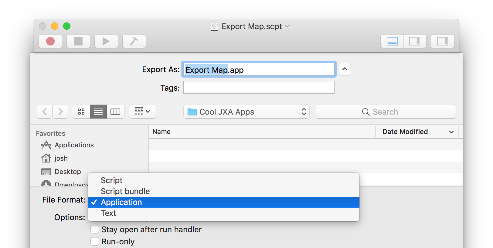

---

# Invocation ❇️

^ Using Automator, you can create a macOS service which executes your JXA wherever an application services menu is. For example, you can create a workflow which accepts folders from the Finder and invokes the script with that.

- Services menu

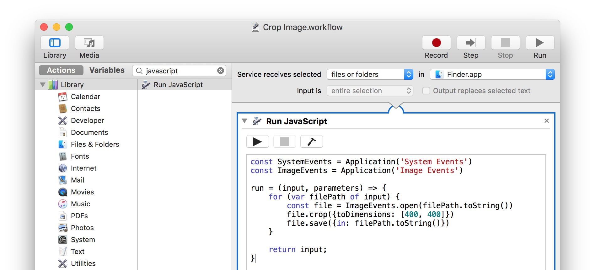

---

# Invocation ❇️

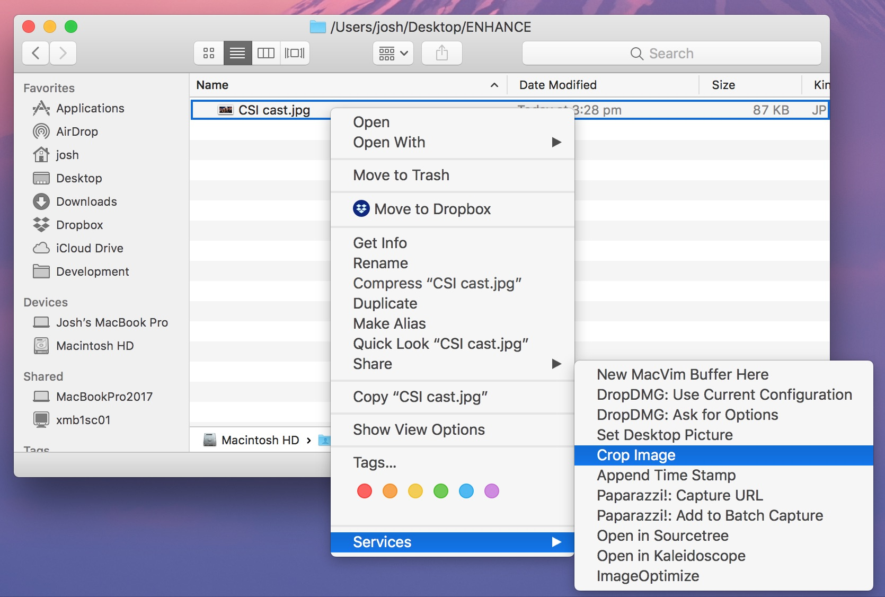

---


# Invocation ❇️

^ This adds a menu bar item which gives you access to scripts in predefined paths on the system.

- System-wide Scripts menu

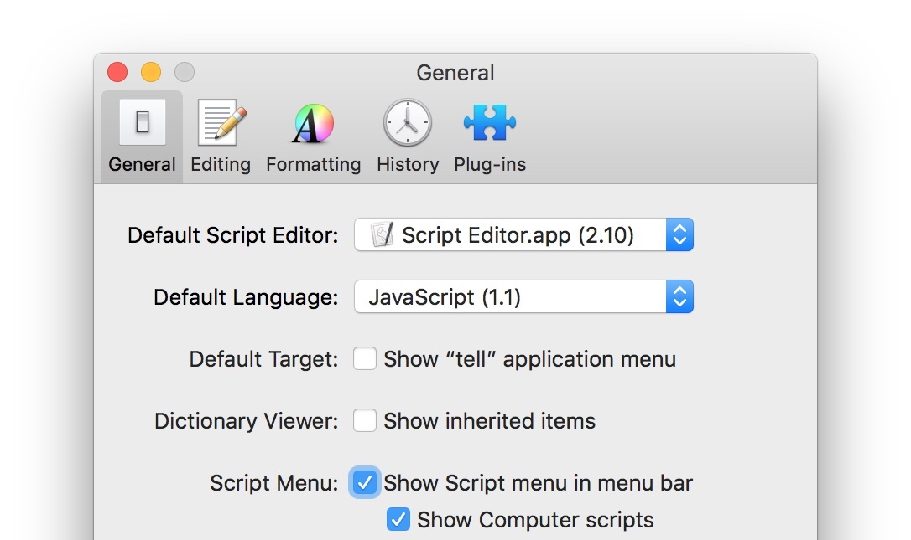

---

# Invocation ❇️

^ https://developer.apple.com/library/archive/documentation/LanguagesUtilities/Conceptual/MacAutomationScriptingGuide/WatchFolders.html#//apple_ref/doc/uid/TP40016239-CH39-SW1

- Folder contents changed
- Calendar alarms
- Dictation command
- and others 🚀

---

# Even Better Invocation 🏜

^ Next macOS improves the accessibility of automation scripts in the Finder.


---

# Even Better Invocation 🏜

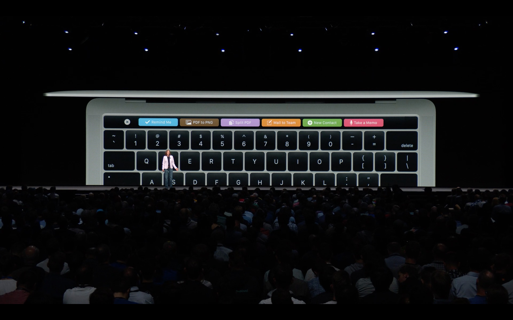

---

# REPL ⌨️

```sh
$ osascript -i -l JavaScript
```

---


---

^ Moving on from there, the `osascript` command can also be used in scripts.

# Scripting ⚡️
## Example: `args.sh`
---

^ `padStart` is actually from ES2017 as well

```js
#!/usr/bin/env osascript -l JavaScript

run = argv => console.log(
  argv.map(x => x.padStart(10)).join('\n')
)
```

---

```sh
$ ./args.sh Hello there MelbJS! 👋

     Hello
     there
   MelbJS!
        👋
```

---

# Interoperability ☕️

^ Can use the standard JavaScript `replace` method...

```js
const result = 'hello'.replace('e', '3')
```

---

# Interoperability ☕️

^ ... or the much nicer Objective-C equivalent.

```js
const result = ObjC.wrap('hello')
.stringByReplacingOccurrencesOfStringWithString('e', '3').js
```

---

# Interoperability Examples ☕️ 

```js
#!/usr/bin/env osascript -l JavaScript

ObjC.import('DictionaryServices')

run = argv => {
    const word = argv[0]
    const range = { 'location': 0, 'length': word.length }
    let definition = $.DCSCopyTextDefinition(null, word, range)
    console.log(definition.js.split(" | ").join("\n"))
}
```

---

# Interoperability Examples ☕️ 

```sh
$ ./define.sh JavaScript

JavaScript
ˈdʒɑːvəˌskrɪpt
noun [mass noun] trademark an object-oriented computer programming
language commonly used to create interactive effects within web browsers.
ORIGIN 1990s: from Java2 + script1.
```

---

# Interoperability ☕️

- Called the `JavaScriptObjC` bridge

---

### JavaScript Context ➡️ Objective-C Context

- Convert primitive JS type to ObjC object

```js
ObjC.wrap(...)
```

^ For some good old jQuery throwbacks, this is also aliased to $

```js
$(...)
```

---

### Objective-C Context ➡️ JavaScript Context

- Convert ObjC object to JS type

```js
ObjC.unwrap(...)
```

^ Aliased to appending `.js` at the end of your line

```js
.js
```

---

## Applications 🖥

^ Massive props to Tyler Gaw for his fantastic example repo, from which this example is adapted: https://github.com/tylergaw/js-osx-app-examples
^ There is an explanatory blog post here: https://tylergaw.com/articles/building-osx-apps-with-js/

- Interoperability with `AppKit`
- Native UIs purely in (bridged) JavaScript

---

^ Cocoa encompasses Foundation, AppKit, and Core Data

```js
ObjC.import('Cocoa')

const resultString = (result) => `Result: ${ result ? result.toString() : ''}`

ObjC.registerSubclass({
	name: 'AppDelegate',
	methods: {
		'calculate:': {
			types: ['void', ['id']],
			implementation: function (sender) {
				var total =
                    Number(textField1.stringValue.js) +
                    Number(textField2.stringValue.js)
				resultTextFieldLabel.stringValue = resultString(total)
			}
		}
	}
})
```

---

```js
var appDelegate = $.AppDelegate.alloc.init

const styleMask =
    $.NSTitledWindowMask |
    $.NSClosableWindowMask |
    $.NSMiniaturizableWindowMask

var window =
    $.NSWindow.alloc.initWithContentRectStyleMaskBackingDefer(
        $.NSMakeRect(0, 0, 250, 120),
        styleMask,
        $.NSBackingStoreBuffered,
        false
    )
```

---

```js
var calculateButton =
    $.NSButton.alloc.initWithFrame(
        $.NSMakeRect(25, 20, 200, 25)
    )
calculateButton.title = 'Calculate 🧙‍♂️'
calculateButton.bezelStyle = $.NSRoundedBezelStyle
calculateButton.buttonType = $.NSMomentaryLightButton
calculateButton.target = appDelegate
calculateButton.action = 'calculate:'
calculateButton.keyEquivalent = '\r'
window.contentView.addSubview(calculateButton)
```

---
```js
var resultTextFieldLabel =
    $.NSTextField.alloc.initWithFrame(
        $.NSMakeRect(25, 45, 200, 24)
    )
resultTextFieldLabel.stringValue = resultString()
resultTextFieldLabel.drawsBackground = false
resultTextFieldLabel.editable = false
resultTextFieldLabel.bezeled = false
resultTextFieldLabel.selectable = true
window.contentView.addSubview(resultTextFieldLabel)
```

---

```js
var textField1 =
    $.NSTextField.alloc.initWithFrame(
        $.NSMakeRect(25, 80, 90, 24)
    )
textField1.stringValue = ''
window.contentView.addSubview(textField1)
```

---

```js
var plusTextFieldLabel =
    $.NSTextField.alloc.initWithFrame(
        $.NSMakeRect(120, 80, 24, 24)
    )
plusTextFieldLabel.stringValue = '+'
plusTextFieldLabel.drawsBackground = false
plusTextFieldLabel.editable = false
plusTextFieldLabel.bezeled = false
plusTextFieldLabel.selectable = true
window.contentView.addSubview(plusTextFieldLabel)
```

---

```js
var textField2 =
    $.NSTextField.alloc.initWithFrame(
        $.NSMakeRect(135, 80, 90, 24)
    )
textField2.stringValue = ''
window.contentView.addSubview(textField2)
```

---

```js
window.center
window.title = 'Scientific Calculator 🙈'
window.makeKeyAndOrderFront(window)
```

^ You can save a script as an Application in Script Editor, or do the below.
^ Need to tick "Stay open after run handler" when exporting in Script Editor.

---

# Packaging 📦

Either through `Script Editor.app` or `osacompile`.

<br />

```sh
osacompile -l JavaScript -o Calculator.app -s Calculator.js
```

---

# *Demo*

---

## PS 🐙

QLScpt

```sh
brew cask install josh-/qlscpt/qlscpt
```

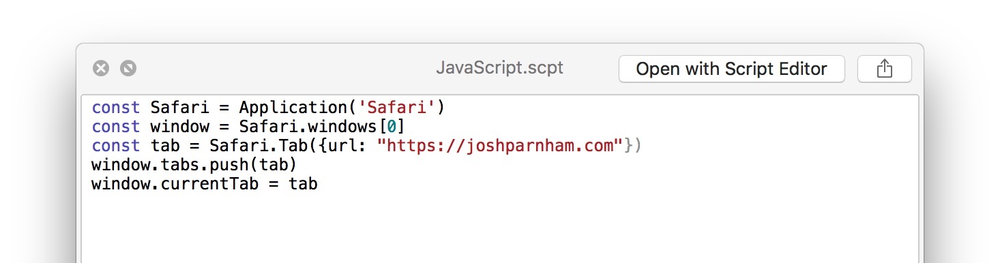

---

## Caveats ✋

^ The documentation is lacking - the main documentation reference contains only two entries for old macOS releases: https://developer.apple.com/library/archive/releasenotes/InterapplicationCommunication/RN-JavaScriptForAutomation/Articles/Introduction.html#//apple_ref/doc/uid/TP40014508-CH111-SW1

^ The best documentation is probably the "About Mac Scripting" guide: https://developer.apple.com/library/archive/documentation/LanguagesUtilities/Conceptual/MacAutomationScriptingGuide/index.html#//apple_ref/doc/uid/TP40016239-CH56-SW1

^ Sample code can also be wrong as well

^ The JXA cookbook has a lot of extra information not covered in the official docs: https://github.com/JXA-Cookbook/JXA-Cookbook

- Limited documentation

^ I've found that `const` variables can persist across invocations within Script Editor, as well as a variety of other issues.

- Buggy

^ Most of the sample code and open source code is written in AppleScript, and it can be non-trivial to convert between the languages.

- Majority of automation code is still AppleScript

- 🐲 **Here be dragons** 🐉

---

# Thanks ✌️
## @joshparnham

^ These slides will be put up in a repo on my GitHub 

## github.com/josh-
